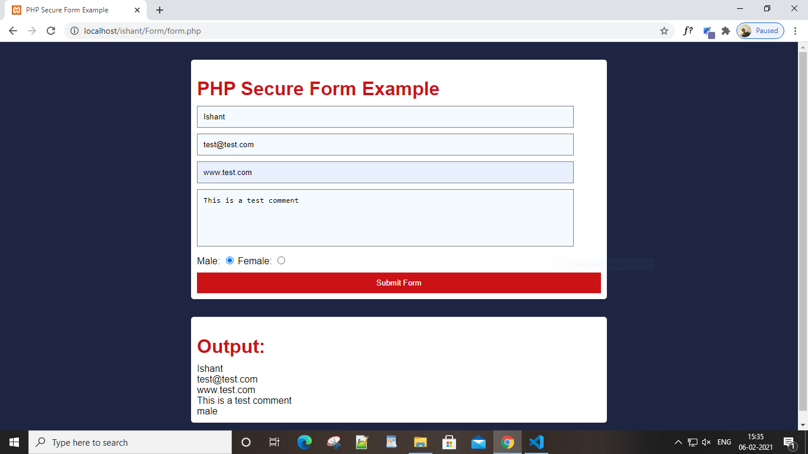

# PHP-Secure-Form-Example
This is a simple php form example where I have used functions such as htmlspecialchars(), stripslashes() etc to prevent the server from attacks such as Cross Site Scripting (XSS).

